# Image_Guided_Surgery_Technology

## proj1.m:

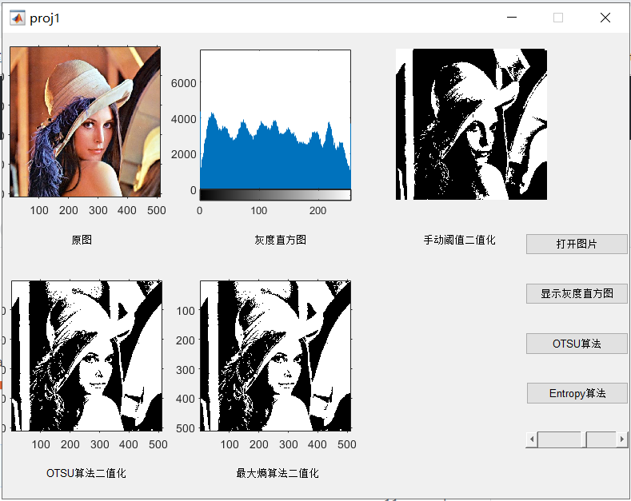

function

- open image
- show the histogram
- using OTSU method to binarize the picture
- using Entropy method to binarize the picture
- using slide to choose the threshold

## proj2.m

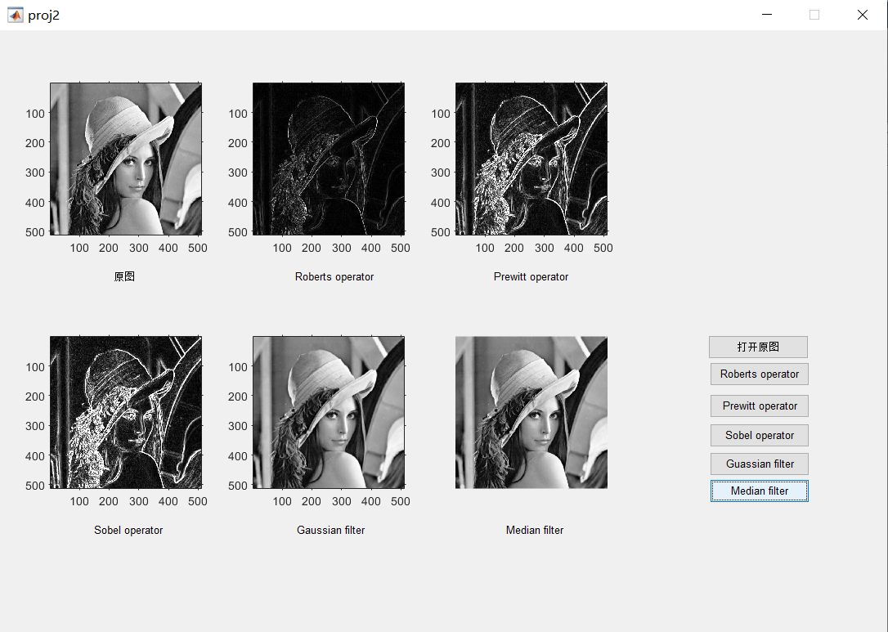

function:

- Roberts operator
- Prewitt operator
- Sobel operator
- Gaussian filter
- Median filter

## proj3.m

function:

- binary erosion
- binary dilation
- binary opening
- binary closing

## proj4.m

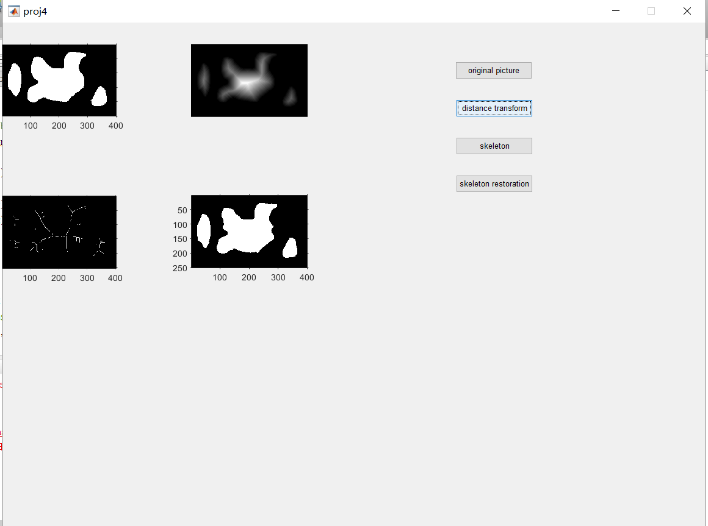

function:

- distance transform
- skeleton
- skeleton restoration

## proj5.m

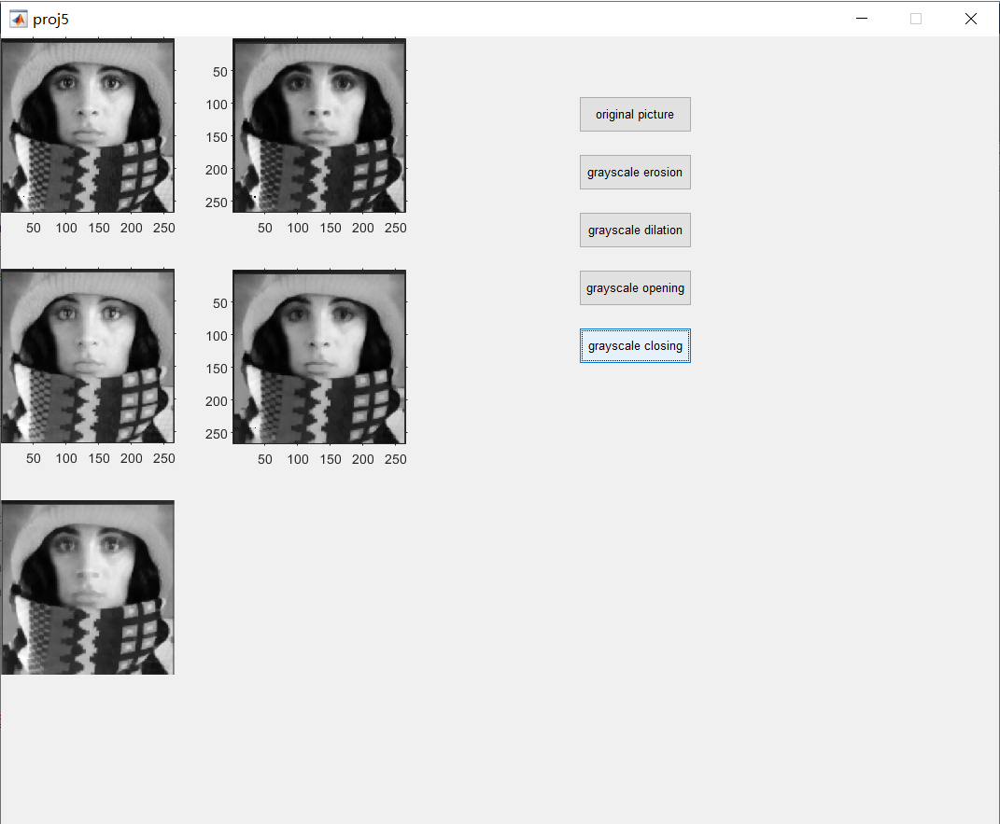

function:

- grayscale erosion
- grayscale dilation
- grayscale opening
- grayscale erosion

## Course Notes

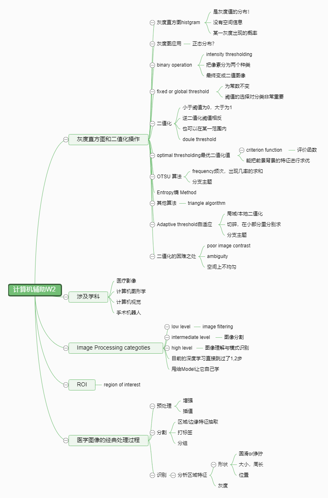

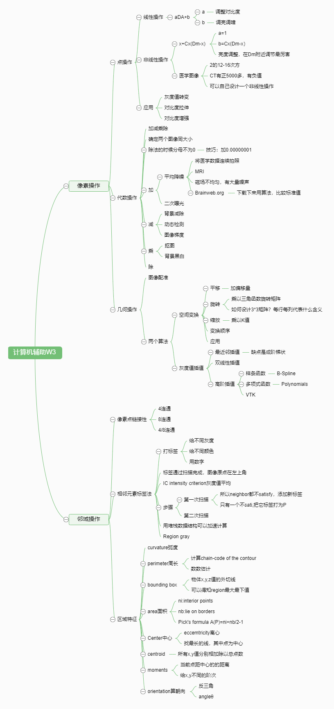

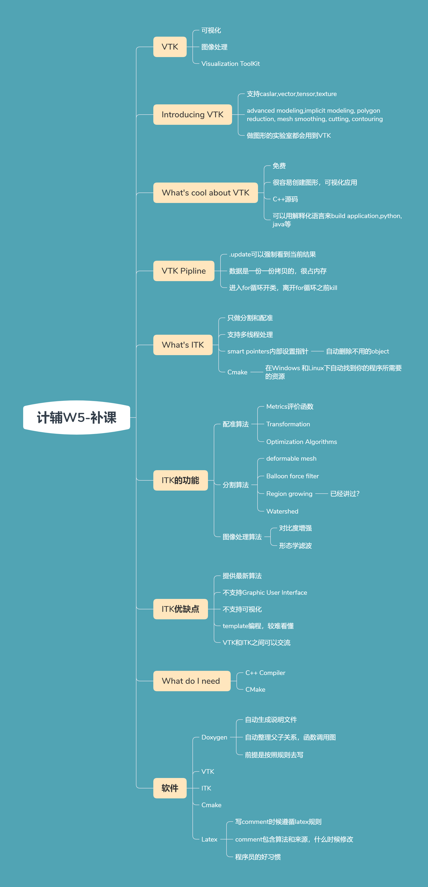

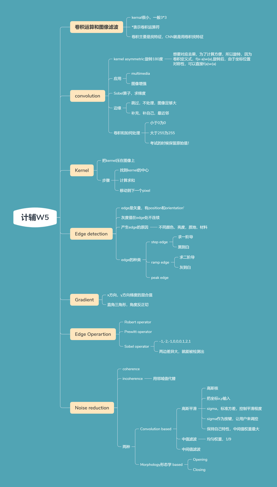

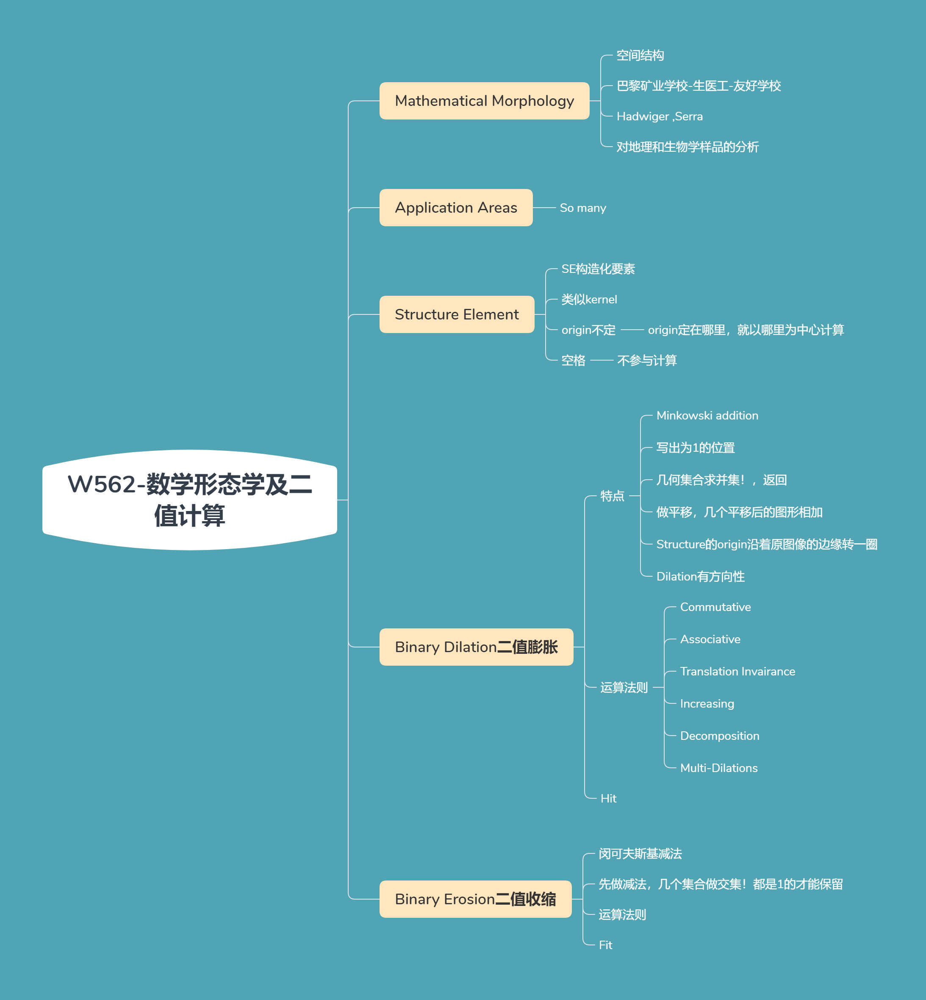

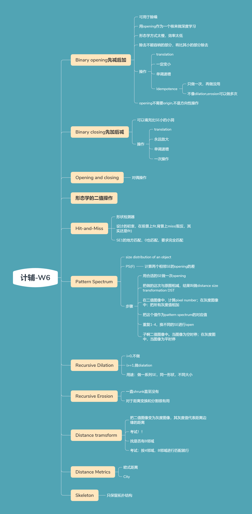

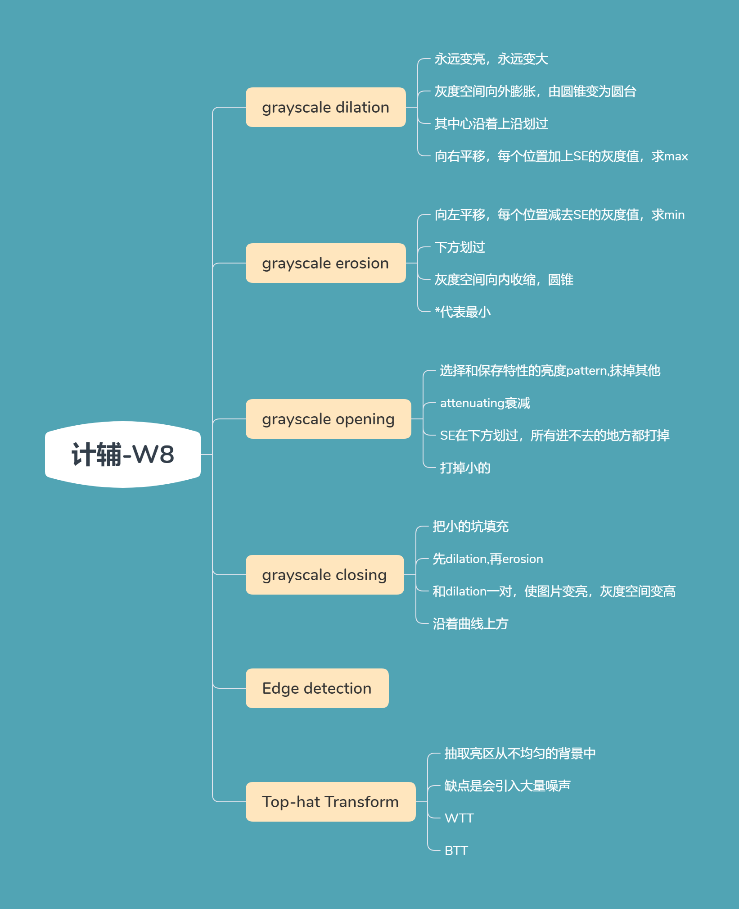
